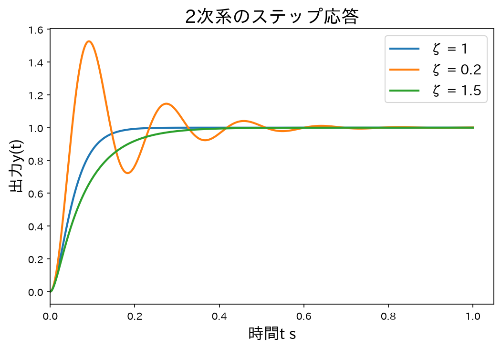
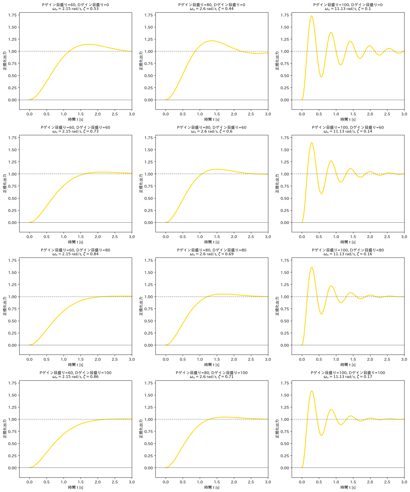

# Control Theory

## サーボ系の PD 制御（servo_pd_control.ipynb）

### 2次系の伝達関数

PD 制御されたサーボ系は、次の標準2次系として近似できる。

$$G(s) = \frac{\omega_n^2}{s^2 + 2\zeta\omega_n s + \omega_n^2}$$

- $\omega_n$：固有角周波数 [rad/s]
- $\zeta$：減衰係数

---

### ステップ応答（減衰比の比較）

$\omega_n = 35\,\mathrm{rad/s}$ を固定し、減衰係数 $\zeta$ を変えたときのステップ応答を重ね書きする。

| $\zeta$ | 挙動 |
|---------|------|
| $\zeta < 1$ | 不足制動（振動的）|
| $\zeta = 1$ | 臨界制動（最速で振動なし）|
| $\zeta > 1$ | 過制動（緩やかに収束）|

---

### 実験に基づくステップ応答（12パターン）

授業の実験で P ゲイン・D ゲインの目盛りを変えながら実測したステップ応答から、各設定における固有角周波数 $\omega_n$ と減衰係数 $\zeta$ を同定した。

同定したパラメータを2次系の伝達関数に代入し、理論ステップ応答を計算・描画したものが以下の 12 パターン（P ゲイン 3 種 × D ゲイン 4 種）である。

| 設定 | $\omega_n$ [rad/s] | $\zeta$ |
|------|-------------------|---------|
| P=60,  D=0   | 2.15  | 0.53 |
| P=80,  D=0   | 2.60  | 0.44 |
| P=100, D=0   | 11.13 | 0.10 |
| P=60,  D=60  | 2.15  | 0.73 |
| P=80,  D=60  | 2.60  | 0.60 |
| P=100, D=60  | 11.13 | 0.14 |
| P=60,  D=80  | 2.15  | 0.84 |
| P=80,  D=80  | 2.60  | 0.69 |
| P=100, D=80  | 11.13 | 0.16 |
| P=60,  D=100 | 2.15  | 0.86 |
| P=80,  D=100 | 2.60  | 0.71 |
| P=100, D=100 | 11.13 | 0.17 |

D ゲインを大きくすると $\zeta$ が増加し、振動が抑制される傾向が確認できる。P=100 の場合は $\omega_n$ が大きく応答が速い一方、$\zeta$ が小さく振動しやすい。

