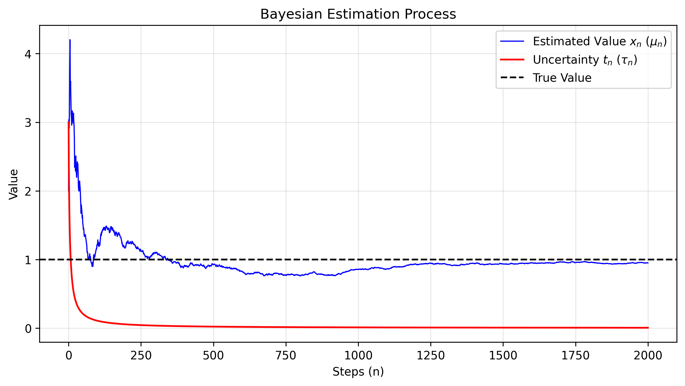
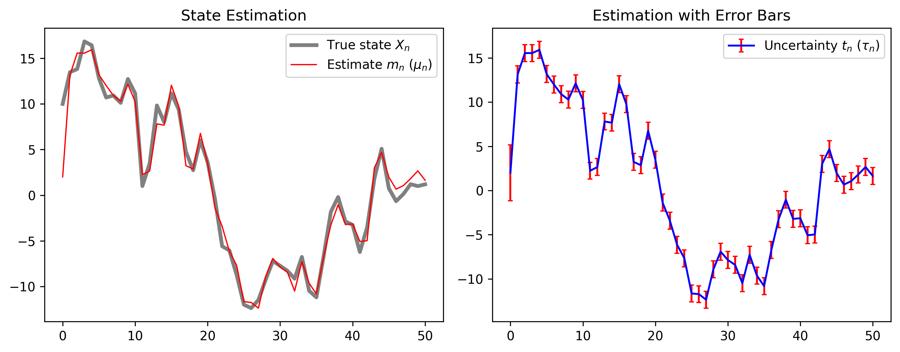

# Numerical Methods

## Monte Carlo Integration

モンテカルロ法による数値積分。$[0, \pi]$ 区間での $\sin(x)$ を例に、乱数サンプリングで積分値を近似する。

$$\int_a^b f(x)\,dx \approx (b-a)\,\frac{1}{N}\sum_{i=1}^{N} f(x_i), \quad x_i \sim \mathrm{Uniform}(a,\,b)$$

$N=100000$ サンプルで Scipy の厳密解との誤差を確認。

---

## Bayesian Estimation

定数値のベイズ再帰推定。$Y = cX + V$ という観測が得られるとき、ガウス分布に従う未知変数 $X$ の事後分布を以下の式で逐次更新する。

**平均 $\mu_n$ の更新:**

$$\mu_n = \mu_{n-1} + \frac{c\tau_{n-1}}{1+c^2\tau_{n-1}}(y_n - c\mu_{n-1})$$

**分散 $\tau_n$ の更新:**

$$\tau_n = \frac{\tau_{n-1}}{1+c^2\tau_{n-1}}$$

### 結果

ステップ数が増えるにつれ、推定値が真値に収束し、不確かさ（分散）が単調減少する。

---

## Kalman Filter

ベイズ推定の動的システムへの拡張。状態 $X_n = aX_{n-1} + bW_n$ が時間発展するとき、観測 $Y_n = cX_n + V_n$ を用いて状態を逐次推定する。

**カルマンゲイン $K$:**

$$K = \frac{c(a^2\tau_{n-1}+b^2)}{1+c^2(a^2\tau_{n-1}+b^2)}$$

**平均 $\mu_n$ の更新:**

$$\mu_n = a\mu_{n-1} + K(y_n - ca\mu_{n-1})$$

**分散 $\tau_n$ の更新:**

$$\tau_n = \frac{a^2\tau_{n-1}+b^2}{1+c^2(a^2\tau_{n-1}+b^2)}$$

### 結果

観測ノイズ・システムノイズの下でも、推定値が真の状態をトラッキングする様子とその不確かさが確認できる。

