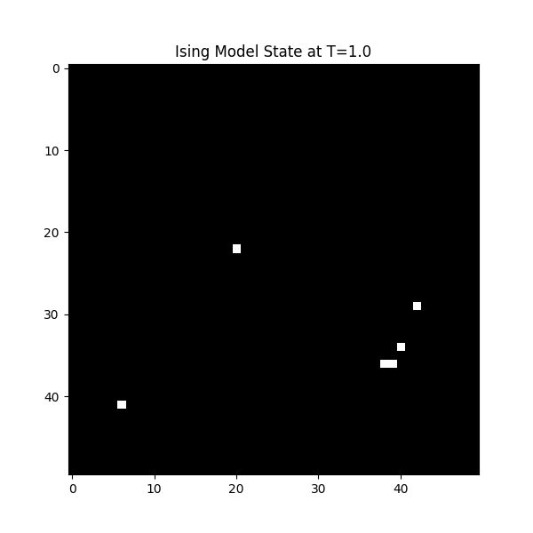
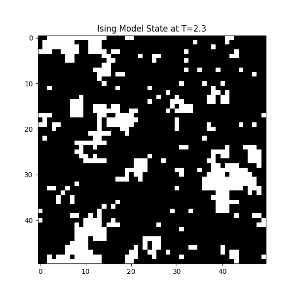
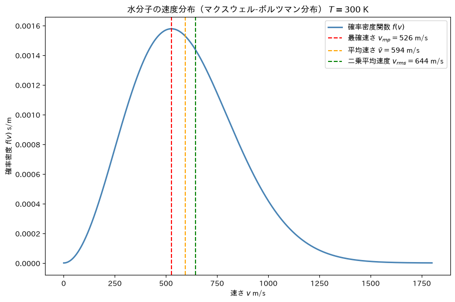

# Statistical Mechanics

## Ising Model

2次元イジングモデルの相転移をメトロポリス法でシミュレーション。
50×50格子、500,000ステップ、周期的境界条件。Numba JIT で高速化。

### 結果

**T = 1.0（秩序相）**  
スピンがほぼ完全に揃い、強磁性状態になる。

**T = 2.3（臨界点付近）**  
onsagerの厳密解による臨界温度 $T_c \approx 2.269$ に近く、スピンドメインの自己相似的なゆらぎが現れる。

---

## Maxwell-Boltzmann Distribution

$$f(\boldsymbol{v})=N \frac{1}{(2 \pi m k_B T)^{\frac{3}{2}}} exp\left(-\frac{mv^2}{2 k_B T}\right)$$

で表されるマクスウェルボルツマン分布に従う水分子の速度分布を $T=300K$ でプロットした。また、最確速さ、平均速さ、二乗平均速度は次のように定義される。

最確速さ

$$\frac{df(v_{mp})}{dv}=0$$

平均速さ
$$\bar{v} = \int_{0}^{\infty} vf(v) dv$$

二乗平均速度
$$v_{rms} = \sqrt{\int_{0}^{\infty} v^2f(v) dv}$$

## 結果

大部分の分子はおおよそ$p\sim\sqrt{m k_B T}$の領域に分布していることがわかる。